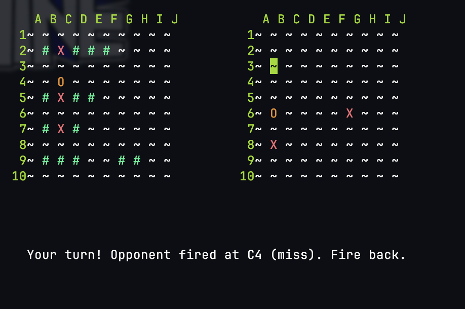
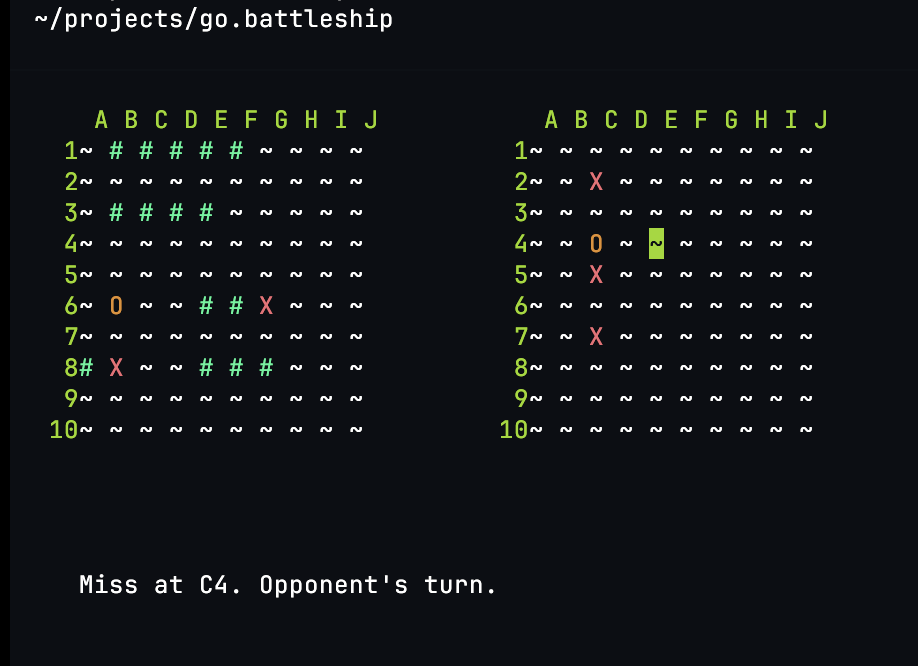
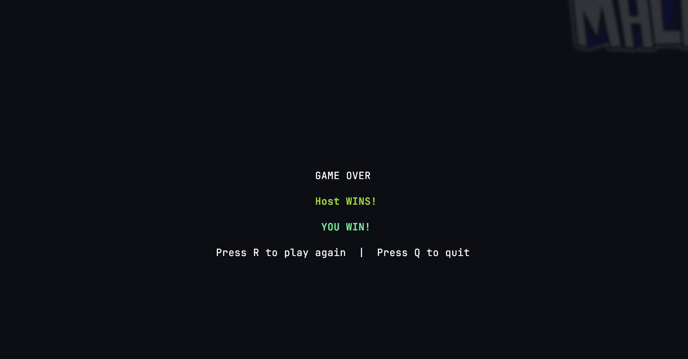
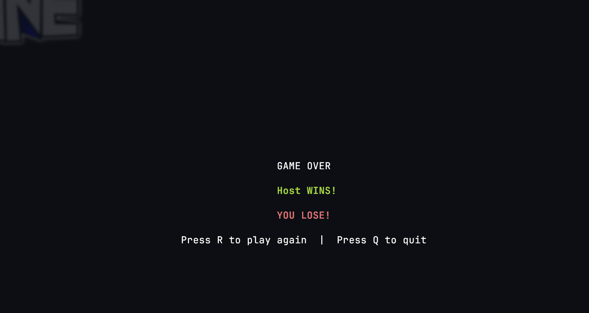

# Go Battleship

A 2-player networked terminal-based Battleship game implemented in Go.

This is a sandbox project to test out gemini/claude when using superpowers extension.

## Features

*   Interactive terminal UI using `tcell`.
*   Cross-network multiplayer via a central gRPC relay server (Cloud Run).
*   Ship placement and battle phases.

## Architecture

Players communicate through a central gRPC relay server hosted on Google Cloud Run. The relay server (written in Ruby) manages game sessions and forwards messages between players via bidirectional gRPC streams. This eliminates the need for port forwarding or being on the same local network.

```
Player A (Go client) ──gRPC──► Cloud Run Relay Server ◄──gRPC── Player B (Go client)
```

## How to Run

### Build the Game
```bash
go build -o battleship .
```

### Configure the Server URL

Create a `.env` file in the project root:
```
SERVER_URL=https://your-relay-server.run.app
```

Alternatively, export it in your shell:
```bash
export SERVER_URL=https://your-relay-server.run.app
```

> You can also pass `--server URL` to override both.

### Host a Game
```bash
./battleship host
```

This creates a new game session and prints a game code (e.g., `XYZABC`) to share with your opponent.

### Join a Game
```bash
./battleship join GAME_ID
```

Replace `GAME_ID` with the code provided by the host.

## Gameplay Instructions

1.  **Placement Phase**: Use arrow keys to navigate and place ships. Press `Enter` to place/set ready, `Spacebar` to remove a ship.
2.  **Battle Phase**: Use arrow keys to navigate the tracking board (right side). Press `Spacebar` to confirm a target (highlighted in orange), then `Enter` to fire. The host always fires first; players alternate turns.
3.  **Game Over**: Press `R` to play again (both players must agree) or `Q` to quit.
4.  **Exit**: Press `Esc` or `Ctrl+C` at any time to exit.

## Screenshots

### Battle Phase

Player 1 (left board: your ships, right board: your shots against opponent):



Player 2 perspective after firing:



### Game Over

Winner screen:



Loser screen:



## Built With

## Authors

* **Namae Conde** - *Initial work* - [namaeconde][githublink]
* **Gemini/Claude**

[githublink]: https://github.com/namaeconde